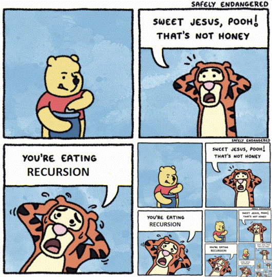

Hello everyone, I’m Santiago and this is the second episode of #100DaysOfCode!

_All the code for this project can be found on my_  [**_Github_**](https://github.com/sanatem/100DaysOfCode/tree/master/day02_twitter-ruby-bot)**_._**

### Challenge: Build a Twitter Bot

Bots, bots everywhere ! How about building one?

First, what is a bot? It's a simple automated program which works over the Internet. For this time, I am going to build one for doing some Twitter tasks.

My objective is to build a Twitter bot which can answers you (mention over Twitter) and depending of the hashtag (message like this: #ThisIsAHashtag), the bot will answer you differently !

For this experiment, the Twitter bot should respond to this hashtags:

-   #Got: The bot returns the house of Game Of Thrones you belong to !
-   #HarryPotter: Similar to #Got, it returns the house of Howarts you belong to !
-   (In the future it is going to answer to more funny hashtags ;) )

### Solution

To come up with this solution I decided to code it all in Ruby.

I used the following gems (ruby libraries):

```
Tweetstream: A high level API to to interact with the Twitter Streaming API. 

faker: A gem that generates fake data.
```

**Step 1:** The first thing to do is to create both clients: A REST and a Streaming client for Twitter API consumption. Both configurations (stream\_config and rest\_config) are set up in the **config.rb** file.

```
@stream_client = TweetStream::Client.new(stream_config)

@rest_client = Twitter::REST::Client.new(rest_config)
```

**Step 2:** We start a loop which check for changes in the timeline of the Bot. Inside the loop we have the incredible **_status_** object where we can check everything, like hashtags or mentions.

```
@stream_client.on_timeline_status do |status|
 # Check if someone mentions the bot in the timeline
 ...

end
```

**Step 3:** Inside the loop we check the status, and the bot will answer with the proper hashtag.

```
def check_status(status)

#Have any hashtag?

return send_regards(status.user.screen_name) unless status.hashtags?

process_hashtags(status.hashtags,status.user.screen_name)

end
```

The **process\_hashtags** method will check in the white list I have defined below if the user used one of them. The **@rest\_client** object has the responsibility to answer.

```
@rest_client.update("Hi @#{user} ! #{message}")
```

The result:


In case the user didn't used any listed hashtags the bot will answer with the available hashtags using the **send\_regards** method.


Thanks to Faker, we can decide randomly which house you belong to :).

---

Well, that's it this time ! Easy and short, isn't?

_Remember, the code for all projects is available_ [**_here_**](https://github.com/sanatem/100DaysOfCode)_._



Stay tuned for Day 03!
