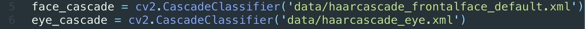
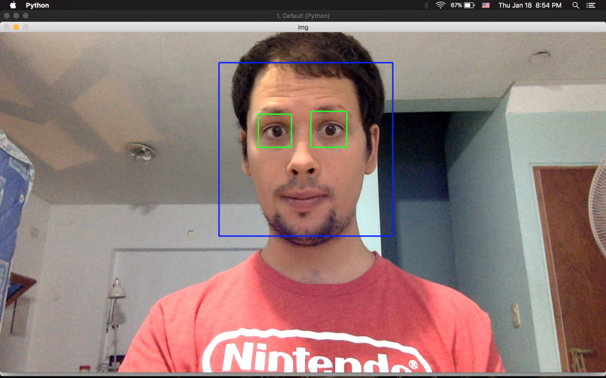

Hi everyone ! I am Santiago, again, and this is the third episode of #100DaysOfCode !

All the code for this project can be found on my [**Github**](https://github.com/sanatem/100DaysOfCode/tree/master/day03_opencv-face-detection).

I want to apologize because It’s been a while since my last post and I want to to explain you (or give you some dull excuse 😜): I’ve been planning this episode for a while and it became too long for the challenge, so I decided to upload all the training code and finish the project with a simple detector.

### Objective: Build a face detector

Well, when I came up with this challenge I wanted to show you a more complex challenge, but I asume I am going to continue with this project in another day, so I am going just to set the basis with this day-3-project:

My goal is: The webcam should detect your face and draw a rectangle on it. Plus: I am going to detect the eyes too (for furthermore analysis!)

### Solution

To came up with the solution I’ve been training with a lot of features of the python’s opencv library (it’s awesome! I highly recommend the folder **training/** inside this projects) like the Otsu algorithm, to draw a rectangle, edge detection and so on..

So let’s take a look to the file: **face\_eyes\_detection.py**

I used the following libraries:

```
numpy: Scientific python lib to handle with advanced math structures

opencv (cv2): Open source computer vision project
```

**Step 0:** Setting up the webcam. The method to capture an image from your webcam is called **VideoCapture** and it receives a number as parameter. The number indicates which webcam is going to be used (In case you have additional webcams connected to your computer try 1, 2 as parameter)

```
cap = cv2.VideoCapture(0)

while True:
  ret, img = cap.read()
  cv2.imshow('img', img)
  # ...
  # Code for processing the frame with the face.
  # ...
  # If you press the 'esc' key it will quit the webcam.
  k = cv2.waitKey(30) & 0xff
  if k == 27:
    break

cap.release()
cv2.destroyAllWindows()
```

**_About the infinite loop:_** _it’s quite simple, we iterate and capture the different frames from the webcam until the ‘esc’ key is pressed and we release the webcam._

**Step 1:** As this is a simple detector I used the [Haar-F](https://singhgaganpreet.wordpress.com/2012/10/14/training-haar-cascade/)ace algorithm implemented in the openCV library. The first step is to set up the classifiers (for eyes and face detection):



**Step 2:** To simplify the task of processing the face we convert the input data in gray-scaled image:

```
gray = cv2.cvtColor(img, cv2.COLOR_BGR2GRAY)
```

**Step 3:** After setting up the classifier the opencv **detectMultiScale()** method do all the recognition work.

```
faces = face_cascade.detectMultiScale(gray, 1.3, 5)

....

eyes = eye_cascade.detectMultiScale(roi_gray, 1.3, 5)
```

**Step 4:** Let me draw a rectangle on that pretty face! To draw a rectangle with opencv the code is pretty simple:

```
# Rectangle: img, from, to, color.
cv2.rectangle(img, (x,y), (x+w,y+h), (255,0,0), 2)
```

#### The final result



---

Well, that’s it ! Quite disappointed? Don’t be afraid my friend, my next post is going to blow your mind!

_Remember, the code for all projects is available_ [**_here_**](https://github.com/sanatem/100DaysOfCode)_._


Stay tuned for Day 04!
